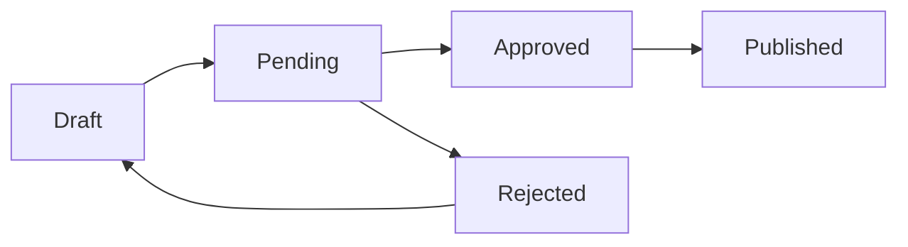

# 🚀 Fonctionnalité : Système de Contribution Collaborative

**Date de création** : 24 novembre 2025
**Statut** : En planification
**Priorité** : Haute

---

## 📋 Résumé

Permettre à des contributeurs externes d'ajouter des exercices et captures d'écran, avec un workflow de validation administrateur.

---

## 🎯 Objectifs

1. **Nouveau rôle utilisateur** : "Contributeur"
2. **Soumission de contenu** : Exercices + captures d'écran
3. **Workflow de validation** : Brouillon → En attente → Approuvé/Rejeté
4. **Gestion d'images renforcée** : Bibliothèque, filtres, recherche
5. **Interface admin** : Validation/modération des contributions

---

## 👥 Rôles et Permissions

### Nouveau rôle : Contributeur
```javascript
USER_ROLES = {
  LEARNER: 'apprenant',
  TRAINER: 'formateur',
  CONTRIBUTOR: 'contributeur',  // ← NOUVEAU
  ADMIN: 'administrateur'
}
```

### Matrice de permissions

| Action | Apprenant | Formateur | Contributeur | Admin |
|--------|-----------|-----------|--------------|-------|
| Voir exercices publics | ✅ | ✅ | ✅ | ✅ |
| Créer exercice brouillon | ❌ | ✅ | ✅ | ✅ |
| Soumettre à validation | ❌ | ❌ | ✅ | ✅ |
| Publier directement | ❌ | ✅ | ❌ | ✅ |
| Valider/rejeter | ❌ | ❌ | ❌ | ✅ |
| Upload images | ❌ | ✅ | ✅ | ✅ |
| Modérer images | ❌ | ❌ | ❌ | ✅ |

---

## 🗄️ Modifications Base de Données (Supabase)

### 1. Ajout du rôle Contributeur
```sql
-- Modifier la table users
ALTER TABLE users 
  DROP CONSTRAINT IF EXISTS users_role_check;

ALTER TABLE users 
  ADD CONSTRAINT users_role_check 
  CHECK (role IN ('apprenant', 'formateur', 'contributeur', 'administrateur'));
```

### 2. Table : contributions (nouveau)
```sql
CREATE TABLE contributions (
  id UUID PRIMARY KEY DEFAULT uuid_generate_v4(),
  contributor_id UUID NOT NULL REFERENCES users(id) ON DELETE CASCADE,
  type TEXT NOT NULL CHECK (type IN ('exercise', 'image', 'category')),
  
  -- Statut de validation
  status TEXT NOT NULL DEFAULT 'draft' 
    CHECK (status IN ('draft', 'pending', 'approved', 'rejected')),
  
  -- Données de la contribution (JSON)
  content JSONB NOT NULL,
  
  -- Métadonnées de validation
  submitted_at TIMESTAMPTZ,
  reviewed_by UUID REFERENCES users(id),
  reviewed_at TIMESTAMPTZ,
  rejection_reason TEXT,
  
  -- Métadonnées générales
  created_at TIMESTAMPTZ DEFAULT NOW(),
  updated_at TIMESTAMPTZ DEFAULT NOW()
);

-- Index pour performance
CREATE INDEX idx_contributions_status ON contributions(status);
CREATE INDEX idx_contributions_contributor ON contributions(contributor_id);
CREATE INDEX idx_contributions_type ON contributions(type);
```

### 3. Table : images_metadata (enrichie)
```sql
CREATE TABLE images_metadata (
  id UUID PRIMARY KEY DEFAULT uuid_generate_v4(),
  
  -- Référence Supabase Storage
  storage_path TEXT NOT NULL UNIQUE,
  public_url TEXT NOT NULL,
  
  -- Métadonnées
  title TEXT,
  description TEXT,
  tags TEXT[], -- Pour filtrage/recherche
  category TEXT,
  
  -- Upload par
  uploaded_by UUID REFERENCES users(id),
  uploaded_at TIMESTAMPTZ DEFAULT NOW(),
  
  -- Statut de modération
  moderation_status TEXT DEFAULT 'pending' 
    CHECK (moderation_status IN ('pending', 'approved', 'rejected')),
  moderated_by UUID REFERENCES users(id),
  moderated_at TIMESTAMPTZ,
  
  -- Utilisation
  usage_count INTEGER DEFAULT 0,
  used_in_tasks UUID[], -- Array de task IDs
  
  -- Dimensions et type
  width INTEGER,
  height INTEGER,
  file_size BIGINT,
  mime_type TEXT,
  
  created_at TIMESTAMPTZ DEFAULT NOW(),
  updated_at TIMESTAMPTZ DEFAULT NOW()
);

-- Index de recherche
CREATE INDEX idx_images_tags ON images_metadata USING GIN(tags);
CREATE INDEX idx_images_category ON images_metadata(category);
CREATE INDEX idx_images_status ON images_metadata(moderation_status);
CREATE INDEX idx_images_uploaded_by ON images_metadata(uploaded_by);
```

### 4. Modifications table tasks
```sql
-- Ajouter champs pour contributions
ALTER TABLE tasks
  ADD COLUMN contributor_id UUID REFERENCES users(id),
  ADD COLUMN contribution_status TEXT CHECK (contribution_status IN ('draft', 'pending', 'approved', 'rejected')),
  ADD COLUMN submitted_at TIMESTAMPTZ,
  ADD COLUMN reviewed_by UUID REFERENCES users(id),
  ADD COLUMN reviewed_at TIMESTAMPTZ;

-- Index
CREATE INDEX idx_tasks_contribution_status ON tasks(contribution_status);
```

---

## 🎨 Nouvelles Interfaces

### 1. Espace Contributeur (`/contributeur`)
**Pages** :
- `/contributeur` : Dashboard contributeur
- `/contributeur/nouvelle-contribution` : Formulaire de soumission
- `/contributeur/mes-contributions` : Liste des contributions
- `/contributeur/bibliotheque-images` : Bibliothèque d'images partagée

**Composants** :
```jsx
ContributorDashboard.jsx
├── ContributionStats.jsx (brouillon, en attente, approuvées)
├── RecentContributions.jsx
└── QuickActions.jsx (nouvelle contribution, bibliothèque)

ContributionForm.jsx
├── ExerciseBuilder.jsx (réutiliser l'existant)
├── ImageUploader.jsx (drag & drop)
├── ImageSelector.jsx (depuis bibliothèque)
└── SubmitButton.jsx (brouillon ou soumettre)

MyContributions.jsx
├── ContributionList.jsx (filtres par statut)
├── ContributionCard.jsx
└── ContributionDetail.jsx
```

### 2. Admin - Modération (`/admin/moderation`)
**Pages** :
- `/admin/moderation/contributions` : File d'attente de validation
- `/admin/moderation/images` : Modération des images

**Composants** :
```jsx
ModerationQueue.jsx
├── ContributionReviewCard.jsx
│   ├── ExercisePreview.jsx
│   ├── ApproveButton.jsx
│   ├── RejectButton.jsx (avec raison)
│   └── EditSuggestions.jsx
└── Filters.jsx (type, date, contributeur)

ImageModeration.jsx
├── ImageGrid.jsx (vue mosaïque)
├── ImageReviewModal.jsx
│   ├── ImageDetails.jsx
│   ├── TagEditor.jsx
│   └── ApproveRejectButtons.jsx
└── BulkActions.jsx (approuver/rejeter multiple)
```

### 3. Bibliothèque d'Images Renforcée (`/admin/images`)
**Fonctionnalités** :
```jsx
ImageLibrary.jsx
├── SearchBar.jsx (titre, tags, catégorie)
├── Filters.jsx
│   ├── CategoryFilter.jsx
│   ├── TagFilter.jsx
│   ├── StatusFilter.jsx
│   └── DateRangeFilter.jsx
├── ImageGrid.jsx (infinite scroll)
│   └── ImageCard.jsx
│       ├── Thumbnail.jsx
│       ├── Metadata.jsx (tags, usage)
│       ├── Actions.jsx (éditer, supprimer)
│       └── UsageIndicator.jsx
└── UploadZone.jsx (drag & drop amélioré)
```

---

## 🔄 Workflow de Validation

### États d'une contribution



### Détails du workflow

1. **Draft** (Brouillon)
   - Contributeur travaille sur l'exercice
   - Sauvegarde automatique
   - Non visible par admin

2. **Pending** (En attente)
   - Contributeur soumet pour validation
   - Apparaît dans file d'attente admin
   - Notification admin (email/in-app)

3. **Approved** (Approuvé)
   - Admin approuve
   - Exercice publié automatiquement ou programmé
   - Notification contributeur

4. **Rejected** (Rejeté)
   - Admin rejette avec raison
   - Contributeur peut modifier et resoumettre
   - Notification contributeur avec feedback

---

## 📦 Nouveaux Composants React

### Structure fichiers
```
src/
├── components/
│   ├── contributor/
│   │   ├── ContributionForm.jsx
│   │   ├── ContributionCard.jsx
│   │   ├── ContributionStatus.jsx
│   │   └── ImageUploadZone.jsx
│   ├── admin/
│   │   ├── ModerationQueue.jsx
│   │   ├── ContributionReview.jsx
│   │   ├── ImageModeration.jsx
│   │   └── ValidationModal.jsx
│   └── images/
│       ├── ImageLibrary.jsx
│       ├── ImageGrid.jsx
│       ├── ImageCard.jsx
│       ├── ImageFilters.jsx
│       └── ImageSearchBar.jsx
├── pages/
│   ├── ContributorDashboard.jsx
│   ├── NewContribution.jsx
│   ├── MyContributions.jsx
│   └── admin/
│       ├── ModerationPage.jsx
│       └── ImageManagementPage.jsx
├── data/
│   ├── contributions.js (API Supabase)
│   └── imagesMetadata.js
└── hooks/
    ├── useContributions.js
    ├── useImageLibrary.js
    └── useModeration.js
```

---

## 🔧 APIs Supabase

### contributions.js
```javascript
// Créer contribution
export async function createContribution(data)
export async function updateContribution(id, data)
export async function submitContribution(id)
export async function getMyContributions(userId)

// Admin
export async function getPendingContributions()
export async function approveContribution(id, reviewerId)
export async function rejectContribution(id, reviewerId, reason)
```

### imagesMetadata.js
```javascript
// Upload avec métadonnées
export async function uploadImageWithMetadata(file, metadata)
export async function searchImages(query, filters)
export async function updateImageMetadata(id, metadata)
export async function moderateImage(id, status, moderatorId)
export async function getImageUsage(imageId)
```

---

## 🎨 UI/UX Améliorations

### 1. Notifications
- Toast pour soumission/validation
- Badge compteur (contributions en attente pour admin)
- Emails automatiques (nouveau système)

### 2. Filtres de recherche avancés
```javascript
ImageFilters = {
  tags: ['smartphone', 'whatsapp', 'paramètres', ...],
  categories: ['Communication', 'Réseaux sociaux', ...],
  status: ['pending', 'approved', 'rejected'],
  uploadedBy: 'user-id',
  dateRange: { from: Date, to: Date },
  usageCount: { min: 0, max: 100 }
}
```

### 3. Drag & Drop amélioré
- Upload multiple
- Preview instantané
- Détection auto de métadonnées (EXIF)
- Compression automatique

---

## 📊 Statistiques Contributeur

Dashboard avec :
- Total contributions (approuvées/rejetées)
- Taux d'acceptation
- Images uploadées
- Graphique mensuel

---

## 🔐 Sécurité & Permissions

### RLS (Row Level Security) Supabase

```sql
-- Contributeurs voient uniquement leurs contributions
CREATE POLICY "Contributors see own contributions"
  ON contributions FOR SELECT
  USING (auth.uid() = contributor_id OR 
         EXISTS(SELECT 1 FROM users WHERE id = auth.uid() AND role = 'administrateur'));

-- Seuls admins peuvent valider
CREATE POLICY "Only admins can review"
  ON contributions FOR UPDATE
  USING (EXISTS(SELECT 1 FROM users WHERE id = auth.uid() AND role = 'administrateur'));
```

---

## 🚀 Plan d'Implémentation

### Phase 1 : Base de données (1-2 jours)
- [ ] Créer migrations SQL
- [ ] Ajouter rôle contributeur
- [ ] Créer tables contributions + images_metadata
- [ ] Configurer RLS policies

### Phase 2 : API & Hooks (2-3 jours)
- [ ] Créer `data/contributions.js`
- [ ] Créer `data/imagesMetadata.js`
- [ ] Hooks React personnalisés
- [ ] Tests API

### Phase 3 : Interface Contributeur (3-4 jours)
- [ ] Dashboard contributeur
- [ ] Formulaire de soumission
- [ ] Mes contributions
- [ ] Bibliothèque d'images

### Phase 4 : Interface Admin (2-3 jours)
- [ ] File d'attente de modération
- [ ] Validation exercices
- [ ] Modération images
- [ ] Statistiques

### Phase 5 : Améliorations UX (2 jours)
- [ ] Notifications
- [ ] Filtres avancés
- [ ] Drag & drop amélioré
- [ ] Responsive design

### Phase 6 : Tests & Déploiement (1-2 jours)
- [ ] Tests utilisateurs
- [ ] Corrections bugs
- [ ] Documentation
- [ ] Déploiement production

**Total estimé : 11-16 jours**

---

## 📝 Décisions Validées ✅

1. **Qui peut devenir contributeur ?**
   - ✅ **Validation admin requise** : Les utilisateurs demandent le statut, admin approuve

2. **Récompenses/gamification ?**
   - ✅ **Système de récompenses à venir** : Traçabilité des contributions intégrée
   - Badges, classement (détails à définir ultérieurement)

3. **Limites de contribution ?**
   - ✅ **Taille max images : 1 Mo**
   - ✅ Outil de redimensionnement déjà intégré au projet

4. **Workflow éditorial ?**
   - ✅ **Admin peut modifier avant publication** : Validation + édition
   - Feedback itératif possible

---

## 🏆 Système de Traçabilité (pour récompenses futures)

### Métriques à tracker par contributeur

```sql
CREATE TABLE contributor_stats (
  user_id UUID PRIMARY KEY REFERENCES users(id),
  
  -- Compteurs
  total_contributions INTEGER DEFAULT 0,
  approved_contributions INTEGER DEFAULT 0,
  rejected_contributions INTEGER DEFAULT 0,
  pending_contributions INTEGER DEFAULT 0,
  
  -- Images
  images_uploaded INTEGER DEFAULT 0,
  images_approved INTEGER DEFAULT 0,
  
  -- Engagement
  first_contribution_at TIMESTAMPTZ,
  last_contribution_at TIMESTAMPTZ,
  streak_days INTEGER DEFAULT 0, -- Jours consécutifs
  
  -- Impact
  total_image_usage INTEGER DEFAULT 0, -- Nombre d'utilisations de ses images
  total_exercise_completions INTEGER DEFAULT 0, -- Exercices complétés par apprenants
  
  -- Qualité
  approval_rate DECIMAL(5,2), -- Taux d'acceptation %
  average_review_time INTEGER, -- Temps moyen de validation (heures)
  
  -- Métadonnées
  updated_at TIMESTAMPTZ DEFAULT NOW()
);

-- Trigger pour mettre à jour automatiquement
CREATE OR REPLACE FUNCTION update_contributor_stats()
RETURNS TRIGGER AS $$
BEGIN
  -- Mise à jour automatique lors de changement de statut
  IF NEW.status != OLD.status THEN
    -- Logique de calcul des stats
    -- (implémentation détaillée à venir)
  END IF;
  RETURN NEW;
END;
$$ LANGUAGE plpgsql;
```

### Événements trackés
- ✅ Soumission contribution
- ✅ Approbation/rejet
- ✅ Utilisation d'une image dans un exercice
- ✅ Complétion d'un exercice créé par le contributeur
- ✅ Modifications par admin

---

## 🚀 Demande d'Accès Contributeur

### Nouveau workflow d'inscription

```sql
CREATE TABLE contributor_requests (
  id UUID PRIMARY KEY DEFAULT uuid_generate_v4(),
  user_id UUID NOT NULL REFERENCES users(id),
  
  -- Motivation
  message TEXT NOT NULL, -- Pourquoi devenir contributeur ?
  experience TEXT, -- Expérience avec smartphones
  
  -- Statut
  status TEXT DEFAULT 'pending' CHECK (status IN ('pending', 'approved', 'rejected')),
  
  -- Admin review
  reviewed_by UUID REFERENCES users(id),
  reviewed_at TIMESTAMPTZ,
  admin_notes TEXT,
  
  created_at TIMESTAMPTZ DEFAULT NOW()
);
```

### Composant : Demande d'accès
```jsx
// src/components/contributor/RequestContributorAccess.jsx
// Formulaire simple : motivation + expérience
// Admin reçoit notification et peut approuver/rejeter
```

---

**Prêt à commencer l'implémentation !** 🚀
